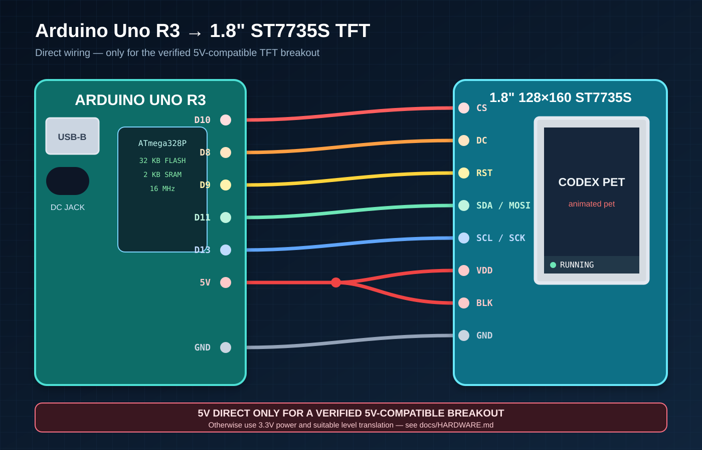
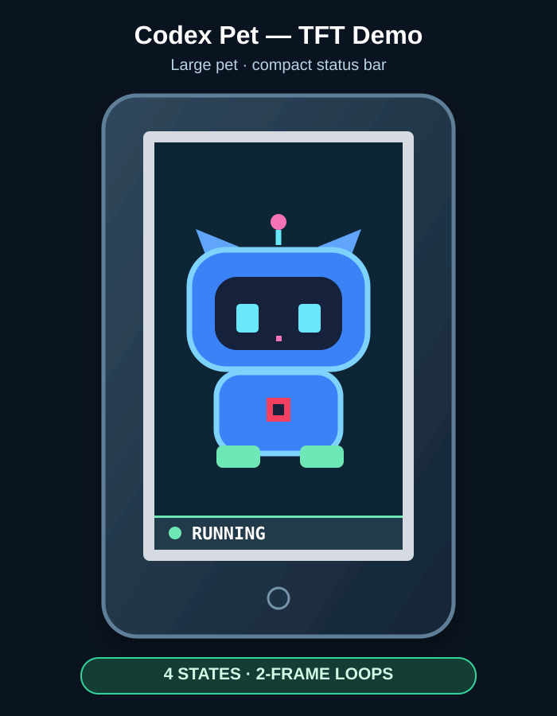

# Codex Pet MCU Desk Companion

[](LICENSE)
[](https://docs.arduino.cc/hardware/uno-rev3/)
[](https://github.com/Bodmer/TFT_eSPI)
[](https://www.python.org/)
[](https://github.com/Coke1120/codex-pet-dev-board/actions/workflows/ci.yml)

Two firmware targets share the same Codex Desktop/CLI hooks and USB Serial
protocol:

- **Arduino Uno R3 + 1.8-inch ST7735 128×160 TFT** — the original low-memory
  reference build with compressed pixel-art frames.
- **GUITION JC4880P443C-I-W + 4.3-inch 480×800 IPS touch display** — an
  ESP-IDF/LVGL build for the ESP32-P4, with the onboard ESP32-C6 available for
  future wireless features.

Both firmware implementations understand the animated `idle`, `running`,
`waiting`, and `review` state model. The Uno build can mirror the selected custom
Codex pet through a gitignored generated header. The P4 public build uses a small
red test tile so CI and new users can compile without private artwork; generating
the gitignored high-resolution local asset activates the selected-pet animation.
The P4 target has been clean-built and flashed on the target board; visual
confirmation of the new selected-pet frames, Serial acknowledgements, and
exhaustive touch/state acceptance remain pending. See [`docs/ESP32_P4.md`](docs/ESP32_P4.md).

> Search keywords: Arduino desktop pet, Codex Pet, physical AI coding assistant, ST7735 animation, TFT_eSPI Arduino Uno, serial status display, pixel art robot pet, macOS and Windows Arduino bridge.

## Features

- Four animated states: `idle`, `running`, `waiting`, and `review`
- Large portrait pet view with a compact status strip
- Real Codex custom-pet frames converted from the selected local atlas
- 8-colour RLE assets and streaming SPI draws designed for Uno flash/RAM limits
- USB Serial control at **115200 baud**
- Compact current-state indicator
- Manual, one-shot, interactive, and stdin-streaming bridge modes
- Direct Codex Desktop/CLI lifecycle sync through official Codex hooks
- Cross-platform host support for macOS `/dev/cu.*` and Windows `COM` ports
- Conservative Arduino-aware serial-port discovery that avoids generic USB adapters
- Verified Serial acknowledgements plus periodic state resynchronization after board resets
- Low-memory design without a full-screen framebuffer
- Documented `TFT_eSPI` `User_Setup.h` for the supplied wiring
- Automated Python regression tests and Arduino Uno compilation in GitHub Actions

## Demo states

| Command | Display behaviour | Suggested meaning |
|---|---|---|
| `idle` | Quiet two-frame loop | Ready or finished |
| `running` | Active two-frame work loop | Coding or executing |
| `waiting` | Expectant two-frame loop | Waiting for user input |
| `review` | Focused two-frame loop | Reviewing code or tests |

Additional diagnostic commands are `ping` and `status`.

## Firmware targets

| Target | Framework | Display | Firmware path |
|---|---|---|---|
| Arduino Uno R3 | Arduino + TFT_eSPI 2.5.43 | ST7735S SPI, 128×160 | `arduino/CodexPet/` |
| GUITION JC4880P443C-I-W | ESP-IDF 5.5.1 + LVGL 9 | ST7701S MIPI-DSI + GT911, 480×800 | `esp32-p4/` |

The ESP32-P4 build uses the onboard ESP32-C6 only as hardware that is available
for future networking; Codex state synchronization currently stays local over
USB Serial. The enclosed camera is not initialized by this firmware; its
inactivity remains part of the physical acceptance checklist.
See [`docs/ESP32_P4.md`](docs/ESP32_P4.md) for exact build, flash, and hardware
verification instructions.

## Hardware

### Arduino Uno reference target

- Arduino Uno R3
- 1.8-inch ST7735 TFT, 128×160 pixels
- USB cable for power and Serial data
- Breadboard wires
- 2.54 mm headers and, for a permanent build, a 2.54 mm perfboard (about 5 × 7 cm)
- Optional: a `TXS0108E` or another translator explicitly rated for 5 V/3.3 V push-pull SPI when the TFT logic inputs are not confirmed 5V-compatible

### Wiring

The photographed breakout is marked `Driver IC: ST7735S` and has this physical pin order:

```text
BLK  CS  DC  RST  SDA  SCL  VDD  GND
```

The photographed module used for the current working prototype has been user-confirmed as 5V-compatible, so the reference wiring can connect it directly to the Uno:

| Arduino Uno R3 | ST7735S | Function |
|---:|---:|---|
| D10 | CS | Chip select |
| D8 | DC | Data/command |
| D9 | RST | Reset |
| D11 | SDA | Hardware SPI MOSI |
| D13 | SCL | Hardware SPI clock |
| 5V | VDD | Module power |
| 3.3V | BLK | Backlight supply for the verified module |
| GND | GND | Common ground |

Keep `SDA` and `SCL` short. The project starts at an 8 MHz SPI clock; reduce `SPI_FREQUENCY` in `config/User_Setup.h` to 4 MHz if long prototype wiring produces noise.

> [!CAUTION]
> A generic bare ST7735S controller is 3.3V logic. Direct Uno wiring is appropriate only for a breakout whose seller documentation or verified hardware confirms 5V-compatible `VDD`, logic inputs, and backlight. If that is not established, use a suitable level translator and 3.3V supply instead. A lit white screen proves only that the backlight has power.

For the full bill of materials, staged power-up checklist, optional translated wiring, perfboard layout, and enclosure guidance, see [`docs/HARDWARE.md`](docs/HARDWARE.md).



## Repository layout

```text
arduino/CodexPet/CodexPet.ino          Arduino Uno firmware
arduino/CodexPet/pet_demo_rle.h        Original MIT-licensed fallback mascot
arduino/CodexPet/pet_generated.h       Optional local generated pet (gitignored)
esp32-p4/                               ESP-IDF firmware for JC4880P443C-I-W
config/User_Setup.h                     Uno TFT_eSPI display and pin configuration
tools/convert_codex_pet.py              Codex atlas → Uno RLE header converter
mac/codex_pet_bridge.py                 Cross-platform USB Serial bridge
mac/codex_pet_hook.py                   Codex lifecycle hook event mapper
mac/codex_pet_daemon.py                 Persistent event aggregator and Serial bridge
mac/requirements.txt                    Python dependency
windows/install.ps1                     Windows runtime/hooks/startup-task installer
docs/HARDWARE.md                        Uno wiring, BOM, perfboard, and enclosure guide
docs/ESP32_P4.md                        ESP32-P4 build, flash, and verification guide
docs/CODEX_DESKTOP.md                   Direct Codex Desktop/CLI synchronization guide
docs/WINDOWS.md                         Windows installation and verification guide
```

## Quick start

## AI-agent handover prompt

Paste the following prompt into Codex, Hermes, Claude Code, or another local AI coding agent when you want it to install, regenerate, repair, or verify this project:

```text
Install or maintain the Codex Pet Arduino project from:
https://github.com/Coke1120/codex-pet-dev-board

Work autonomously until the physical pet is working, but preserve unrelated local changes and do not publish private/custom character artwork.

Environment and hardware:
- Target board: Arduino Uno R3 (`arduino:avr:uno`).
- Display: 1.8-inch 128x160 ST7735S SPI TFT.
- Firmware pins: CS=D10, DC=D8, RST=D9, MOSI/SDA=D11, SCK/SCL=D13.
- First run `arduino-cli board list` and use only the port identified as Arduino UNO.
- Inspect the exact TFT breakout before wiring. For the verified module, use VDD=5V and BLK=3.3V; direct Uno GPIO is acceptable because its logic inputs were confirmed 5V-compatible. Otherwise use the optional 3.3V + level-translator path in docs/HARDWARE.md. Never infer 5V tolerance from the ST7735S controller name alone.

Selected Codex pet:
- Read `${CODEX_HOME:-$HOME/.codex}/config.toml` or `~/.codex/config.toml` and find `[desktop].selected-avatar-id`.
- Resolve that pet under `${CODEX_HOME:-$HOME/.codex}/pets/`.
- Run `tools/convert_codex_pet.py` against its `spritesheet.webp` to create the gitignored `arduino/CodexPet/pet_generated.h` at 86x94.
- Do not commit or publish `pet_generated.h` unless redistribution rights are explicit.

Build and host integration:
- Install TFT_eSPI 2.5.43 and apply `config/User_Setup.h`.
- Compile the public fallback once without `pet_generated.h`, then compile the local custom build with it present. Report flash and SRAM for both.
- Upload the local custom build.
- On macOS, create/use the Python venv under `mac/.venv`; on Windows, use `windows/install.ps1`. Install `mac/requirements.txt`, then run all tests plus syntax checks.
- Configure or merge Codex hooks from `examples/codex-hooks.json`; do not overwrite unrelated hooks.
- Install the host runtime: macOS uses `~/Library/Application Support/CodexPet/runtime` plus a LaunchAgent; Windows uses `%LOCALAPPDATA%\CodexPet\runtime` plus a Scheduled Task. Follow `docs/CODEX_DESKTOP.md` and `docs/WINDOWS.md`.

Verification:
- Use one persistent Serial session at 115200 baud.
- Require exact `pong` and `OK IDLE/RUNNING/WAITING/REVIEW` replies.
- Visually verify a large moving pet, compact status bar, correct orientation/colours, no full-screen blink, and all four states.
- Confirm the LaunchAgent is running and lifecycle events move running -> review/waiting -> idle.
- Run: Python tests, Python syntax, both Uno compiles, P4 converter unit tests,
  `git diff --check`, and secret/absolute-path scans.
- If asked to publish, review the final diff, keep custom artwork private, commit, push, and watch GitHub Actions to success.
```

### 1. Install and configure TFT_eSPI

Install [`TFT_eSPI`](https://github.com/Bodmer/TFT_eSPI) **2.5.43** from the Arduino IDE Library Manager. This is the version exercised by the local build and CI checks.

TFT_eSPI keeps controller and pin settings inside the library rather than the sketch. Back up the library's current `User_Setup.h`, then copy this repository's setup into place:

```bash
cp /path/to/Arduino/libraries/TFT_eSPI/User_Setup.h \
   /path/to/Arduino/libraries/TFT_eSPI/User_Setup.h.backup
cp config/User_Setup.h \
   /path/to/Arduino/libraries/TFT_eSPI/User_Setup.h
```

If the library is shared with other displays, copy the setup to:

```text
TFT_eSPI/User_Setups/Setup_CodexPet_Uno_ST7735.h
```

Then select only that file from `TFT_eSPI/User_Setup_Select.h`:

```cpp
#include <User_Setups/Setup_CodexPet_Uno_ST7735.h>
```

### 2. Convert your selected Codex pet (optional)

Codex custom pets normally live under `${CODEX_HOME:-$HOME/.codex}/pets/`. Codex Desktop records the active custom pet in `~/.codex/config.toml`, for example:

```toml
[desktop]
selected-avatar-id = "custom:sakamata-chloe"
```

The public repository includes an original MIT-licensed fallback mascot. To build with your own compatible 192×208-cell Codex v2 atlas, generate the gitignored local header:

```bash
python3 tools/convert_codex_pet.py \
  --spritesheet "$HOME/.codex/pets/<pet-folder>/spritesheet.webp" \
  --output arduino/CodexPet/pet_generated.h \
  --width 86 \
  --height 94
```

Requirements and constraints:

- `ffmpeg` must be installed.
- The converter selects two frames from rows `0` (idle), `6` (waiting), `7` (running), and `8` (review).
- It emits an 8-colour RGB565 palette plus one-byte RLE runs; the Uno streams pixels directly to the TFT and does not allocate a framebuffer.
- `pet_generated.h` is intentionally gitignored. Keep it private unless you own or have explicit permission to redistribute the source character art.
- Recompile after conversion and check flash use. Larger dimensions or additional frames can exceed the Uno's usable 32 KB program space.

The firmware automatically uses `pet_generated.h` when present; otherwise it builds with the original fallback mascot.



### 3. Upload the firmware

1. Open `arduino/CodexPet/CodexPet.ino` in Arduino IDE.
2. Select **Tools → Board → Arduino Uno**.
3. Run `arduino-cli board list` (or use the IDE port menu) and select the port actually identified as **Arduino UNO**. Do not assume an unrelated `/dev/cu.usbserial...` adapter is the board.
4. Click **Verify**, then **Upload**.
5. Open Serial Monitor at **115200 baud** with newline enabled.
6. Send `idle`, `running`, `waiting`, or `review`.

### 4. Install the host bridge

#### macOS

```bash
cd mac
python3 -m venv .venv
source .venv/bin/activate
python3 -m pip install -r requirements.txt
```

List serial ports:

```bash
python3 codex_pet_bridge.py --list
```

Start interactive mode:

```bash
python3 codex_pet_bridge.py --port auto --interactive
```

Send one state:

```bash
python3 codex_pet_bridge.py --port auto --state running
```

Stream newline-delimited states from another program:

```bash
printf 'running\nwaiting\nreview\nidle\n' | \
  python3 codex_pet_bridge.py --port auto --stdin
```

Opening an Uno serial port usually resets the board. The bridge therefore waits for startup and requires a `pong` handshake before sending states.

#### Windows

The same Python bridge and daemon support Windows `COM` ports. Run the PowerShell installer once:

```powershell
Set-ExecutionPolicy -Scope Process Bypass
.\windows\install.ps1
```

It installs an isolated runtime under `%LOCALAPPDATA%\CodexPet`, safely merges Codex hooks, and creates a per-user startup task. See [`docs/WINDOWS.md`](docs/WINDOWS.md) for requirements, verification, explicit `COM` selection, and removal.

## Connecting a coding workflow

For direct Codex Desktop/CLI reflection, use the official lifecycle-hook integration in [`docs/CODEX_DESKTOP.md`](docs/CODEX_DESKTOP.md). The hook maps active turns, tool calls, approvals, review/test commands, and turn completion into the four display states; the persistent daemon keeps the Serial port open and aggregates concurrent Codex sessions.

The manual `--stdin` method below remains useful for non-Codex tools or custom workflows.

The most reliable integration is for the process that knows the real activity phase to write explicit newline-delimited states to a persistent `--stdin` bridge:

```text
running
waiting
review
idle
```

Keeping one bridge process open avoids resetting the Uno for every transition. A wrapper can send `running` before a task, `waiting` when input is required, `review` during review or test phases, and `idle` on completion. The Codex daemon also re-sends the current state periodically, so a board reset cannot silently leave the display out of sync.

## Development verification

Run the discoverable Python regression suite and syntax checks:

```bash
mac/.venv/bin/python -m unittest discover -s tests -v
PYTHONPYCACHEPREFIX=/tmp/codex-pet-pycache \
  mac/.venv/bin/python -m py_compile mac/*.py tools/*.py tests/*.py
```

Compile the firmware against the supplied display configuration:

```bash
arduino-cli compile --fqbn arduino:avr:uno arduino/CodexPet
```

### ESP32-P4 target

Generate a private selected-pet asset when desired, then build the public or
custom target:

```bash
cd esp32-p4
idf.py set-target esp32p4
idf.py build
```

See [`docs/ESP32_P4.md`](docs/ESP32_P4.md) for the asset generator, exact port
identification, flash procedure, and physical acceptance checklist.

GitHub Actions repeats the Python, Uno, and public ESP32-P4 builds for every
push and pull request.

## TFT troubleshooting

- **Lit white screen:** the backlight is powered but the controller has not initialized. Check common ground, `CS/DC/RST`, `MOSI/SCK`, and confirm `DC → D8`, `RST → D9`. If using a translator, also check its rails, enable pin, and A/B orientation.
- **Unlit black screen:** check `VDD`, `BLK`, ground, and the module's documented supply voltage before debugging SPI.
- **Shifted or cropped image:** try one of `ST7735_BLACKTAB`, `ST7735_GREENTAB`, or `ST7735_GREENTAB2` instead of `ST7735_REDTAB`. Enable only one.
- **Red and blue swapped:** enable `#define TFT_RGB_ORDER TFT_BGR` in `User_Setup.h`.
- **Flicker or corrupted pixels:** shorten wires, verify voltage compatibility (and level translation when required), and reduce `SPI_FREQUENCY` from 8 MHz to 4 MHz.
- **Limited animation performance:** TFT_eSPI is primarily optimised for 32-bit MCUs. The project avoids large buffers so it can use the generic AVR path, but an RP2040 or ESP32 provides smoother animation and more room for sprites.

## Arduino Uno R3 capacity notes

The Uno R3 is deliberately small by modern standards:

- ATmega328P program flash: **32 KB total**
- Bootloader reservation: roughly **0.5 KB**, leaving **32,256 bytes** for a normal sketch
- SRAM: **2 KB**
- EEPROM: **1 KB**

A full 128×160 RGB565 framebuffer alone needs **40,960 bytes**, so it cannot fit in Uno SRAM. A locally generated custom-pet build can store eight `86×94` frames in program flash using an 8-colour palette and RLE, then stream each decoded frame directly to the TFT. The verified custom build currently uses approximately **30 KB (93%) flash** and **507 bytes (24%) SRAM**; the smaller public fallback build leaves more flash free. The exact numbers printed by your toolchain are authoritative.

This is enough for a large two-frame loop in each of the four states, but not for the complete 8×11 desktop atlas. For full-frame-count animation, smoother motion, richer colour, or runtime loading from storage, use a board such as an RP2040 or ESP32 with substantially more flash and RAM.

## Ideas for expansion

- Add `success`, `error`, `sleeping`, or notification states
- Store compact RGB565 sprite frames in `PROGMEM`
- Add an SD card for image assets, with a separate chip-select pin
- Move to RP2040 or ESP32 for `TFT_eSprite` double buffering
- Add a buzzer, buttons, rotary encoder, or ambient-light sensor
- Control the backlight through a suitable transistor or MOSFET
- Extend the protocol with sequence IDs and an explicit firmware-side timeout fallback
- Add a Linux service installer for the existing portable Python bridge

## Compatibility notes

TFT_eSPI describes itself as a library for 32-bit processors, while its current source also contains a generic AVR path. This project uses that generic AVR path and avoids a framebuffer. With TFT_eSPI 2.5.43, the supplied setup, and a locally generated eight-frame `86×94` pet header, the verified custom build uses about 30 KB (93%) of flash and 507 bytes (24%) of SRAM. The public fallback mascot uses less flash. For a new build where the microcontroller is flexible, RP2040 or ESP32 is recommended.

## Contributing

Bug reports, display-tab findings, bridge improvements, and new lightweight animations are welcome. Please read [CONTRIBUTING.md](CONTRIBUTING.md) before opening a pull request.

## Security

Do not include serial-device inventories, usernames, home-directory paths, credentials, or private logs in issues. See [SECURITY.md](SECURITY.md) for responsible reporting.

## Support

If this project is useful, you can [sponsor its maintenance on GitHub](https://github.com/sponsors/Coke1120).

## License

Released under the [MIT License](LICENSE). Optional dependencies and their
redistribution boundaries are documented in
[`THIRD_PARTY_NOTICES.md`](THIRD_PARTY_NOTICES.md).

## Acknowledgements and trademark notice

- Display support is provided by the community-maintained [`TFT_eSPI`](https://github.com/Bodmer/TFT_eSPI) library.
- Arduino is a trademark of Arduino SA.
- OpenAI and Codex are trademarks of OpenAI. This independent community project is not affiliated with or endorsed by OpenAI.
